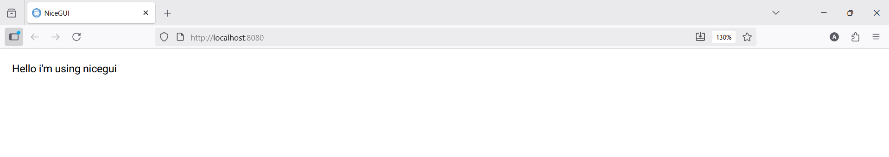

# Code Explanation by me

1. First create a seperate virtual environment using cmd for using `NiceGUI`
```bash
python -m venv nicegui
```
- This tells the `python` interpreter to run the module `venv`  as a script using `-m` flag to create a folder named `nicegui` where the virtual environment will be created.  
- `venv` is the built-in module that creates virtual environments.A virtual environment like `nicegui` created here has it's own copy of python interpreter,package manager,installed libraries.

2. Activating the virtual environment
```bash
nicegui\Scripts\activate
```
- This will activate the `nicegui` virtual environment i created above.
- The cmd will show that the environment is active by showing the name of the environment in paranthesis at the beginning ().  

Before
```bash
D:\learning\Learn NiceGui
```
After  
```bash
(nicegui) D:\learning\Learn NiceGui>
```

3. importing the `NiceGUI` library
- In the command line where the virtual environment is active run the below command
```bash
pip install nicegui
```
- This command installs the `NiceGUI` library into the virtal environment ONLY as i have activated the virtual environment.

## Code
```python
from nicegui import ui
ui.label("Hello i'm using nicegui")
ui.run()
```  


`from nicegui import ui`  
- This means from/inside the `nicegui` package import the module named `ui`.  

`ui.label("Hello i'm using nicegui")`
- From the `ui` module call the function `.label()` and provide the text "Hello i'm using nicegui".This text will be visible in the browser.

`ui.run()`
- `.run()` is the function inside the `ui` module that starts the NiceGUI (ASGI)server and makes the UI available in the browser.

- When the main.py file is executed By default vscode goes to http://127.0.0.1:8080/ 
```bash
(nicegui) D:\learning\Learn NiceGui\Getting Started - Python NiceGUI Tutorial 1>python main.py
NiceGUI ready to go on http://localhost:8080,and more
```
I can select any of the above and see my output in the browser.  

```python
ui.run(host='0.0.0.0', port=9000, reload=True, title='My App')
```
Additional customizations can be done for `ui.run()`
- host='0.0.0.0' --> For making the output accessible from other devices on my network.
- port=9000 --> for using a different port.
- reload=True --> auto-reload when code changes.
- title='My App' --> for setting the HTML page title


