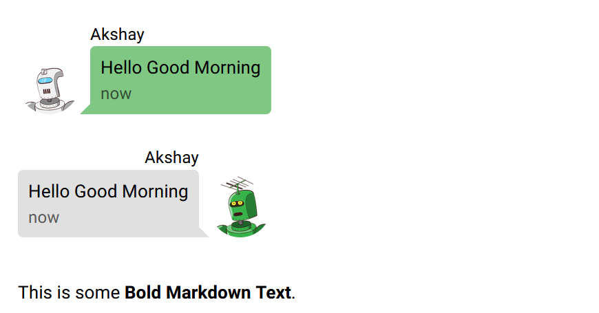
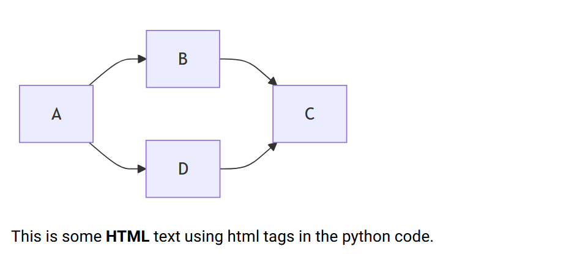

# Code Explanation by me

```python
from nicegui import ui
ui.label("Welcome Back Agent 47")
ui.link("Goto google search","https://www.google.com/")
ui.chat_message("Hello Good Morning",name="Akshay",stamp="now",avatar="https://robohash.org/XG4.png?set=set1&size=150x150")
ui.chat_message("Hello Good Morning",name="Akshay",stamp="now",avatar="https://robohash.org/V67.png?set=set1&size=150x150",sent=True)
ui.markdown("This is some **Bold Markdown Text**.")
ui.mermaid('''
graph LR;
           A-->B-->C
           A-->D-->C
 ''')
ui.html('This is some <strong>HTML</strong> text using html tags in the python code.')
ui.run()
```


---
1. Using label(),link() functions
```python
from nicegui import ui
ui.label("Welcome Back Agent 47")
ui.link("Goto google search","https://www.google.com/")
```
---

`from nicegui import ui`
- This means from/inside the `nicegui` package import the module named `ui`


  

`ui.label("Welcome Back Agent 47")`
- from the `ui` module use the `.label()` function to create a text label component for displaying the text "Welcome Back Agent 47".
- It is similar to <p> paragraph tag in HTML


`ui.link("Goto google search","https://www.google.com/")`
- From the `ui` module use the `.link()` function to create a clickable link.
- Here in `.link()` **the first argument** "Goto google search" is the text that will be displayed.
- **The second argument** is "https://www.google.com/" is the URL to where the text displayed will lead to when clicked.
- Similar to </a> anchor tag. 


---

2. Using  chat_message(),markdown() functions

```python
ui.chat_message("Hello Good Morning",name="Akshay",stamp="now",avatar="https://robohash.org/XG4.png?set=set1&size=150x150")
ui.chat_message("Hello Good Morning",name="Akshay",stamp="now",avatar="https://robohash.org/V67.png?set=set1&size=150x150",sent=True)
```
---


```python
ui.chat_message("Hello Good Morning",                name="Akshay",stamp="now", avatar="https://robohash.org/V67.png?set=set1&size=150x150",sent=True) 
```


- From the `ui` module use the `chat_message()` function to create a chat-style message bubble.
- **The first argument** is "Hello Good Morning".It is the **message text** shown inside the bubble.
- **Second argument** `name="Akshay"` is the name of the person who is sending the message.It is displayed above the message bubble.
- **Third argument** `stamp="now"` is the timestamp when message is sent here i just used the text "now" it can be replaced with using code from the datetime module to get real time.
- **Fourth argument** `avatar="..."` this argument contains the URL of the avatar image of the person.
- **Fifth argument** `sent=True` This argument says the message is from me(right Side) and the code without this argument is present on the right side and the code without this argument will be present on the left side.


`ui.markdown("This is some **Bold Markdown Text**.")`
- `.markdown()` creates a text area where we can write using Markdown syntax.I typed "This is some **Bold Markdown Text**." where the text Bold Markdown Text will be having bold style.
- `ui.label()` shows only plain text.




3. Using  mermaid(),html() functions

``` python
ui.mermaid(''' graph LR;
     A-->B-->C  
     A-->D-->C ''')
```
- `.mermaid()` function is used to render Mermaid diagrams directly in the web app.
- `ui.mermaid()` takes a string of mermaid code and displays the diagram in the UI
- `graph LR;` this code defines type and direction of the diagram.
- `graph` means make a flowchart,`LR` means **Left to Right** direction.
- There is `TB` for Top to Bottom ,`RL` for Right to Left,`BT` for Bottom to Top.
- `A-->B-->C` this string creates nodes and arrows.**A** is connected to **B** wth an arrow **-->**.**B** is connected to **C**.
- ` A-->D-->C` creates another path where **A** is connected to **D** and **D** is connected to **C**.


`ui.html('This is some <strong>HTML</strong> text using html tags in the python code.')`
- `.html()` function let's to write HTML directly in python.Any html put inside is rendered in the web page as HTML and not plain text.
- Here i used `<strong>` for bold text so the text HTML will appear bold in the browser.



